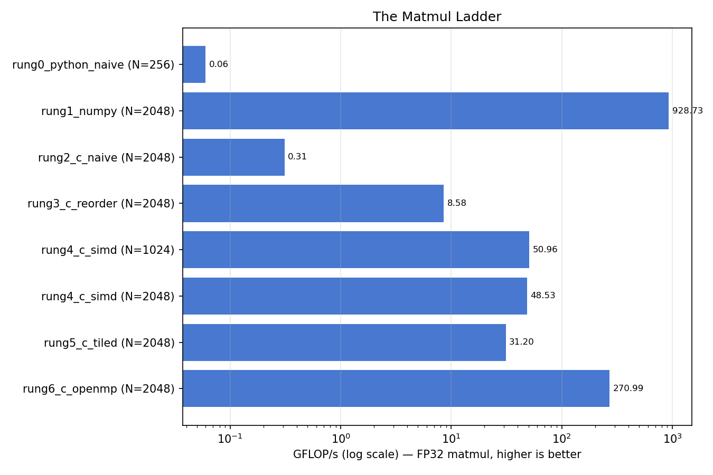

# DS635 Lab 1 — The Matmul Ladder

## Group

| Name | Roll No |
| --- | --- |
| Dhruv Parmar | 202518030 |
| Mahak Khurdia | 202518039 |

---

# 1. Machine identity and `ladder.png`

---

# 2. The five filled tables

## Table 1 — The ladder (Part 1)

| Rung | My GFLOP/s | Lecture laptop | My jump vs previous rung |
| --- | ---: | ---: | ---: |
| Naive Python (N=256) | 0.06 | 0.05 | — |
| NumPy (N=2048) | 928.73 | 249 | ×15,479 |
| Naive C (N=2048) | 0.31 | 0.37 | ÷2,996 |
| Loop reorder (N=2048) | 8.58 | 3.5 | **×27.7** |
| SIMD (N=1024) | 50.96 | 31.5 | ×5.94 |
| SIMD (N=2048) | 48.53 | 14.2 | ×0.95 |
| Tiled (N=2048) | 31.20 | 30.8 | ×0.64 |
| OpenMP (N=2048) | 270.99 | 106 | ×8.69 |

## Table 2 — Cache detective (Part 2)

| | Predicted | Measured | Ratio |
| --- | ---: | ---: | ---: |
| **Naive D1** (lab command, 64 B) | 1,073,741,824 | **1,076,182,547** | **1.002** |
| **Reordered D1** (lab command, 64 B) | 67,108,864 | **67,470,868** | **1.005** |
| Naive D1 (real geometry, 128 B) | 1,073,741,824 | 1,076,032,000 | 1.002 |
| Reordered D1 (real geometry, 128 B) | 33,554,432 | 33,720,576 | 1.005 |
| Naive LLd (real geometry) | 131,072 (compulsory) | 132,248 | 1.009 |
| Reordered LLd (real geometry) | 131,072 (compulsory) | 132,247 | 1.009 |

## Table 3 — Memory wall (Part 3)

| N | B = 4N² | vs 16 MB L2 | GFLOP/s | Δ |
| ---: | ---: | --- | ---: | ---: |
| 512 | 1.0 MB | fits easily | 45.34 | — |
| 1024 | 4.0 MB | fits | 49.70 | +9.6% |
| 1536 | 9.0 MB | fits | 48.52 | −2.4% |
| 2048 | 16.0 MB | exactly at capacity | 49.07 | +1.1% |
| 3072 | 37.7 MB | 2.4× over | 45.79 | −6.7% |
| 4096 | 67.1 MB | 4.2× over | **35.21** | **−23.1%** ← cliff |

## Table 4 — Tile-size sweep (Part 4a), N=2048

| T | 3·T²·4 bytes | Fits in… | GFLOP/s |
| ---: | ---: | --- | ---: |
| 32 | 12 KB | L1d (128 KB) | 4.33 |
| 64 | 48 KB | L1d | 15.44 |
| 128 | 192 KB | L2 (16 MB) | 30.95 |
| 256 | 768 KB | L2 | **36.02** ← best of prescribed set |
| *(extra)* 16 | 3 KB | L1d | 7.22 |
| *(extra)* 512 | 3 MB | L2 | **37.43** ← best overall |
| *(reference)* untiled `rung4_c_simd` | — | — | ***49.07*** |

**Table 4b (for Q4.2)** — guard `for (int j = jj; j < jj + T && j < n; j++)`, T=256, N=2048:

| | GFLOP/s | `fmla v<N>.4s` | any `v<N>.4s` | `ymm` |
| --- | ---: | ---: | ---: | ---: |
| Without guard | **35.61** | **16** | 50 | 0 |
| With guard | **7.17** | **0** | 32 | 0 |
| Cost | **÷4.97** | −100% | −36% | — |

## Table 5 — Thread scaling (Part 5), N=2048, T=128, `OMP_PLACES=cores`

| Threads | GFLOP/s | Speedup |
| ---: | ---: | ---: |
| 1 | 23.30 | 1.00× |
| 2 | 44.50 | 1.91× |
| 4 | 89.40 | 3.84× |
| 6 | 113.99 | 4.89× |
| 8 | 158.99 | 6.82× |
| 12 | 161.95 | **6.95×** ← flat |
| 16 | 274.52 | **11.78×** |
| 18 | 272.71 | 11.70× |

| Threads | 1 | 6 | 8 | 12 | 16 | 18 |
| --- | ---: | ---: | ---: | ---: | ---: | ---: |
| GFLOP/s | 30.72 | 170.52 | 205.70 | **277.07** | 281.25 | 280.83 |
| Speedup | 1.00× | 5.55× | 6.70× | **9.02×** | 9.16× | 9.14× |

---

# 3. Answers to Q1.1 – Q5.1

### Q1.1 — Which single rung gave the biggest multiplicative jump on your machine? Was it the same rung as on the lecture laptop?

The **loop reorder, ×27.7** (0.31 → 8.58), beating SIMD (×5.94) and OpenMP (×8.69). Same rung as the lecture laptop, but **2.9× bigger** than their ×9.46, because my **128 B line** means the naive strided `B[k*n+j]` uses 4 of 128 bytes (3.1%) versus 6.25% on their 64 B line — so making it stride-1 recovers twice as much. Part 2 confirms it: D1 misses fall **31.9×**.

### Q1.2 — Pick the rung where your number differs most (as a ratio) from the lecture laptop's, and explain the difference using a hardware fact about your machine.

**SIMD at N=2048: 48.53 vs 14.2, a 3.42× gap**, and size-specific — at N=1024 I'm only 1.62× ahead. **Their laptop has a 16 MB L3; mine has no L3 at all**, so where B (exactly 16 MB at N=2048) thrashes their shared L3 and collapses them 31.5 → 14.2, my 16 MB L2 is *private to the 6-core Super cluster* with an SLC behind it and I dip 4.8%. Not "my CPU is faster": at N=1024 I lead by only 1.62× while using **4 lanes to their 8**.

### Q2.1 — The naive run's read miss rate comes out to almost exactly 50%. The inner loop makes exactly two reads per iteration. Which one misses, which one hits, and why?

**`B[k*n+j]` misses; `A[i*n+k]` hits.** A walks along a row stride-1 and the whole 4 KB row stays resident in a 128 KB L1d; B walks down a column at stride 4 KB ≫ the 128 B line, so every step is a new line and reuse would need all 4 MB of B to survive in L1d. One miss per two reads = **50.0%**, as measured — residual A misses are just **2,440,723**, 0.23% of A's reads.

### Q2.2 — LLd misses are nearly identical for both versions, even though one is 9× faster. What are these misses (name the category), and what does their equality tell you about where in the hierarchy the 9× was won?

**Compulsory (cold-start) misses:** A, B, C_ref and C total 16 MB = **131,072 lines** at 128 B that must come from DRAM once regardless of loop order (measured 132,248). The premise only holds on my real geometry — under cachegrind's default 256 KB LL they differ 16×, but with my 16 MB LLC they match to **one miss** (132,248 vs 132,247). Equal DRAM traffic means **none** of the speedup came from the memory bus: it was won **entirely between L1 and L2**, where D1 misses fell 31.9×.

### Q3.1 — Where did your cliff land relative to your predicted N\*? If they disagree, consider: is L3 shared or per-core-complex on your CPU? Does the working set include more than just B?

Predicted **N\* = 2048**; the cliff starts **between 3072 and 4096 — 2× later and far gentler** (−23% vs their −55%), and even at N=3072 with B 2.4× larger than L2 I still hit 45.79. Three reasons: my L2 is **per-cluster and not the last level** (Apple's SLC sits behind it, size unexposed, so I couldn't put it in N\*); the working set that matters is one 4N-byte row of B and C, a **pure sequential stream** the prefetcher handles, so the cost is bandwidth not latency; and the real limit is bandwidth at a fixed **0.5 FLOP/byte**, so GFLOP/s = 0.5 × GB/s.

| N | traffic 4N³ | time | delivered BW | 0.5 × BW | measured |
| ---: | ---: | ---: | ---: | ---: | ---: |
| 2048 | 34.4 GB | 0.350 s | 98.2 GB/s | 49.1 | **49.07** |
| 3072 | 116 GB | 1.266 s | 91.6 GB/s | 45.8 | **45.79** |
| 4096 | 275 GB | 3.904 s | 70.5 GB/s | 35.2 | **35.21** |

The roofline predicts every point to three significant figures: my wall is **single-core bandwidth falling ~98 → ~70 GB/s**, not a capacity edge.

### Q3.2 — Same binary, same flags, same algorithm at every N — in one sentence, what changed across the cliff?

**Where B's bytes came from** — on-package cache at ~98 GB/s below N≈3072, DRAM at ~70 GB/s at 4096 — and at a pinned 0.5 FLOP/byte that 1.4× bandwidth drop *is* the 1.4× throughput drop.

### Q4.1 — Explain your winning T from your cache sizes. Why does T=256 (or your largest losing T) fall off, even though bigger tiles mean more reuse per byte?

**My prediction was wrong both ways and nothing falls off:** T=256 wins the prescribed set (36.02), T=512 is still climbing (37.43), and **tiling never beats untiled** (49.07 — the best tile is 24% slower, and still loses at N=4096). Big T can't fall off because even T=512 needs 3 MB, **19% of my 16 MB L2** — I'd need T≈1180 to feel pressure. Small T hurts instead: T=16 gives only **4 NEON iterations**, too few to amortize unroll prologues and five enclosing loops, worsened by tile rows sitting **8 KB apart** (power-of-two conflict thrashing — the likely reason T=32 is worse than T=16, which I did not isolate). Fundamentally, Part 3 shows rung 4 was **never memory-bound at N=2048**, so tiling cures a disease this machine doesn't have.

### Q4.2 — Report GFLOP/s and the instruction count with and without the guard. The guard is semantically harmless here (N % T == 0, so `j < n` is always true). Why does the compiler give up vectorizing anyway — what would it have to prove, and can it?

**35.61 → 7.17 GFLOP/s, ÷4.97**, with vector FMAs `fmla v.4s` going **16 → 0** — so the guard doesn't add a compare, it **destroys vectorization**, and 4 lanes plus unrolling is exactly that ~5×. GCC says so under `-fopt-info-vec-all`: `not vectorized: number of iterations cannot be computed`. It would have to prove **`jj + T <= n` for every tile** so the trip count stays the constant T=256; **it can't**, because that follows only from `n % T == 0` and needs *jj ≡ 0 (mod T)* ∧ *n ≡ 0 (mod T)* ∧ *jj < n* — a **nonlinear modular invariant**, and GCC's range propagation tracks intervals, not congruences. A compiler optimizes what it can prove, not what is true.

### Q5.1 — Name the three shared resources from lecture that eat the missing speedup, and point at the evidence for at least one of them in your table.

**(1) Memory bandwidth** — 16 threads demand 549 GB/s at 0.5 FLOP/byte and then it stops: **16 → 18 gains nothing** (274.52 → 272.71). **(2) Shared LLC capacity** — the 16 MB L2 splits across its cluster's 6 cores, and the **first sag is at 4→6 threads**, efficiency 96% → 82%, exactly where the Super cluster fills. **(3) Core heterogeneity/clock** — 6 "Super" vs 12 "Performance" cores, and `OMP_PLACES=cores` can't help since `lscpu` reports one undifferentiated 18-core cluster.

**A fourth cause actually shapes my table: load imbalance.** The parallel loop has only **16 iterations** at N=2048/T=128, so `schedule(static)` over 12 threads caps effective parallelism at 16/2 = **8** — predicting 158.99 against **161.95 measured, within 2%**; at 16 threads each gets 1 chunk and it jumps to 11.78×. Re-running at N=3072 (24 tiles) removes the artifact: **9.02× at 12 threads**.

---

# Stretch — Break the harness on purpose (`-ffast-math`)

**Prediction:** removing `-ffast-math` should cost most of the SIMD speedup, since vectorizing a float sum requires reassociating additions, which IEEE-754 forbids by default.

**Measured — it cost nothing.** All rows below were measured in one pass; absolute values sit ~1.6× under §2 because the machine was under sustained load by then, so only within-table ratios are meaningful.

| Build (N=2048, 3 reps) | GFLOP/s | vector `fmla v.4s` |
| --- | ---: | ---: |
| `rung4` SIMD, `-ffast-math` | **32.01** | 90 |
| `rung4` SIMD, strict IEEE-754 | **31.99** | 90 |
| `rung3` scalar reorder, untiled | 5.49 | 0 |
| `rung3` scalar reorder, tiled T=128 | 4.79 | 0 |

**None** of rung 4's SIMD speedup depended on reordering float additions — identical throughput, identical 90 vector FMAs either way. Rung 3 had already removed the reduction: the `i-k-j` inner loop is `C[i*n+j] += a * B[k*n+j]`, elementwise across `j` with **no cross-iteration dependency**, so each lane accumulates into a *different* `C` element and vectorizing changes no summation order at all. It is bit-exact under IEEE-754, so the compiler needs no permission.

The rung where reassociation **is** required is the naive `i-j-k` loop, whose `s += A[i*n+k] * B[k*n+j]` is a true reduction over `k`: vector `fmla` counts go **14 → 0** when `-ffast-math` is dropped. IEEE-754 forbids that by default because float addition is **not associative** — `(a+b)+c ≠ a+(b+c)` under rounding — so splitting one serial sum into 4 lane-partial sums gives a different, equally valid result, and the standard requires reproducible rounding. Tellingly, allowing it there *loses*: **0.45 GFLOP/s with `-ffast-math` vs 0.58 without**, because that loop misses cache on every `B` access (Part 2), and widening the arithmetic cannot help something bound entirely on memory.

*Corroborating Part 4:* rebuilt with scalar flags, tiling gains **nothing** over the untiled scalar reorder — **4.79 vs 5.49 GFLOP/s**, a 13% loss. Roofline in miniature: tiling only pays once the compute roof is high enough to hit the memory wall, and neither the scalar rung nor (on this machine) the SIMD rung ever gets there.
